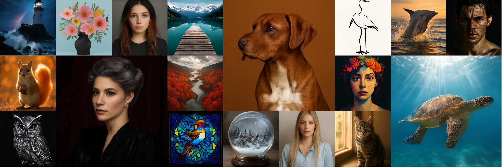
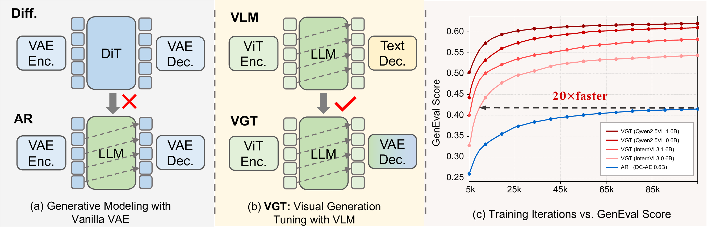
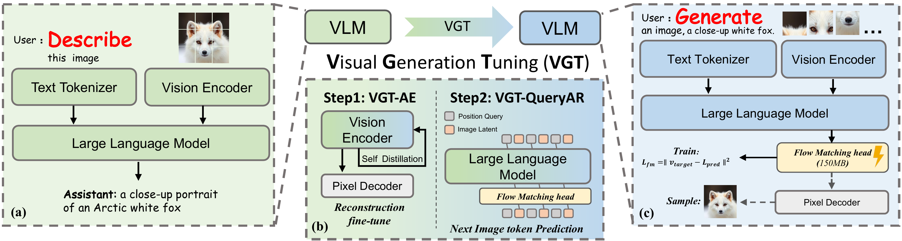
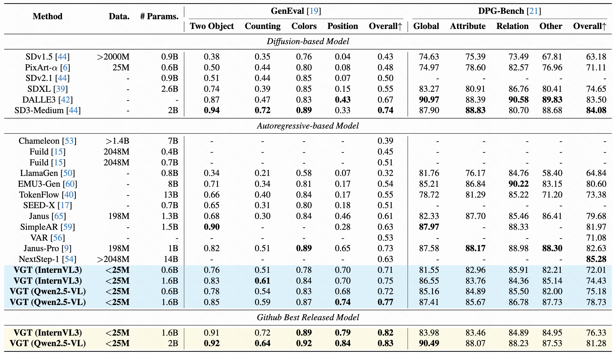

<div align="center">
<h2>🚀 VGT: Visual Generation Tuning</h2>

<div align="center">

</div>

**_Unleashing Visual Generation Capabilities from Any Pretrained VLM_**

**GenEval 0.83 | DPG-Bench 81.28 | 20× Faster Convergence**

Jiahao Guo¹ ⁴*, Sinan Du² ⁴*, Jingfeng Yao¹, Wenyu Liu¹, Bo Li⁴, Haoxiang Cao³ ⁴,  
Kun Gai⁴, Chun Yuan², Kai Wu⁴†, Xinggang Wang¹✉

¹Huazhong University of Science and Technology (HUST)  
²Tsinghua University  
³South China Normal University  
⁴Kolors Team, Kuaishou Technology

*Equal Contribution | †Project Lead | ✉Corresponding Author

[](LICENSE)
[](https://github.com/hustvl)
[](https://huggingface.co/hustvl/vgt_qwen2.5vl_1_6B_sft)
[](https://huggingface.co/hustvl/vgt_internvl3_1_6B_sft)
[](https://arxiv.org/abs/2511.23469)

</div>

<div align="center">

</div>

---

## 📰 News

- **[2025.12.26]** 🎉 Released complete training code and evaluation scripts, include VGT-AE(tokenizer) and VGT-AR
- **[2025.12.1]** 🚀 Released VGT inference scripts
- **[2025.11.19]** 📊 Achieved SOTA performance on GenEval and DPG-Bench benchmarks

---

## ✨ Highlights

- **🎯 Novel Paradigm**: Transform ANY pretrained Vision-Language Model into a powerful image generator through efficient visual generation tuning
- **⚡ 20× Speedup**: Achieve dramatically faster convergence compared to vanilla VAE-based autoregressive models
- **📊 SOTA Performance**: GenEval **0.83** and DPG-Bench **81.28** with minimal training data
- **🚀 Extreme Data Efficiency**: Reach GenEval 0.55 in just 10K iterations, 0.60 in 30K iterations
- **🔄 Parallel Inference**: QueryAR mechanism enables 16× parallel decoding while maintaining high-quality generation
- **🎨 Superior Reconstruction**: 26.67 PSNR and 0.50 rFID at 28× compression ratio, outperforming specialized VAEs

---

## 💡 What is VGT?

**VGT (Visual Generation Tuning)** is a groundbreaking paradigm that answers a fundamental question:

> *Can we directly leverage the well-aligned semantic representations in pretrained VLMs to enable visual generation capabilities?*

### The Core Problem


<div align="center">

</div>

Existing autoregressive image generation models face a critical dilemma:
- **VQ-based methods** (e.g., VQGAN) introduce quantization errors
- **Vanilla VAE approaches** suffer from training instability and poor alignment with autoregressive modeling due to pixel-level optimization

### Our Solution

VGT bridges this gap through two key innovations:

<div align="center">

</div>

**1. VGT-AE (Visual Generation Tuning - AutoEncoder)**
- Aligns semantic encoders from pretrained VLMs with latent representations of pixel decoders
- Preserves semantic structure via self-distillation loss
- Applies channel normalization and noise regularization for robust latent representations
- Achieves **26.67 PSNR** and **0.50 rFID** at **28× compression**, outperforming specialized VAEs

**2. VGT-AR (Visual Generation Tuning - AutoRegressive)**
- Position-query mechanism for autoregressive formulation with partial parallel decoding
- Lightweight flow matching head predicts continuous latent representations
- Dramatically accelerates convergence (**20× speedup**) compared to vanilla VAE-based models


### Why VGT Works

The structured semantic representations learned by pretrained VLMs are inherently conducive to continuous autoregressive modeling. By efficiently tuning on these representations, VGT:
- **Mitigates alignment costs** between vision and language modalities
- **Accelerates convergence** in continuous-space autoregressive modeling
- **Enables unified models** capable of both multimodal understanding and visual generation

---

## 📊 Results

### Text-to-Image Generation Performance

<div align="center">

</div>

**Highlights**: 
- 🏆 **SOTA among autoregressive models** with GenEval **0.83** and DPG-Bench **81.28**
- 🎯 **Extreme data efficiency**: Trained on only **<25M samples** (vs. 198M-2048M+ for competitors)
- ⚡ **Competitive with diffusion models** despite using far less data and compute

### Image Reconstruction Quality

Evaluated on ImageNet 50K validation set (256×256):

| Method | Type | Ratio | rFID ↓ | PSNR ↑ | SSIM ↑ |
|:-------|:-----|:-----:|:------:|:------:|:------:|
| **Generative-Only Tokenizers** |
| VQGAN | VQ | 16× | 4.98 | 20.00 | 0.629 |
| LlamaGen | VQ | 16× | 2.19 | 20.79 | 0.675 |
| SD-VAE | VAE | 16× | 2.64 | 22.13 | 0.590 |
| VAR | VAE | 16× | 1.00 | 22.63 | 0.755 |
| Open-MAGVIT2 | VQ | 16× | 1.67 | 22.70 | 0.640 |
| RAE | VAE | 16× | 0.49 | 19.23 | 0.620 |
| DC-AE | VAE | 32× | 0.69 | 23.85 | 0.660 |
| **CLIP-based Tokenizers** |
| VILA-U | CLIP | 16× | 1.80 | - | - |
| TokenFlow | CLIP | 16× | 1.37 | 21.41 | 0.687 |
| DualViTok | CLIP | 16× | 1.37 | 22.53 | 0.741 |
| UniLIP | CLIP | 32× | 0.79 | 22.99 | 0.747 |
| **VGT (Ours)** |
| VGT-AE (Qwen2.5VL) | VLM | 28× | 1.93 | 20.12 | 0.677 |
| VGT-AE (InternVL3) | VLM | **28×** | **0.50** | **26.67** | **0.863** |

**Highlights**:
- 🏆 **Best reconstruction quality**: 26.67 PSNR and 0.50 rFID at 28× compression
- 📊 **Outperforms specialized VAEs**: Superior to SD-VAE, VAR, and other tokenizers
- 🎯 **Higher compression ratio**: Achieves 28× compression vs. 16× for most methods

### Parallel Inference

<div align="center">

</div>

VGT's QueryAR mechanism enables **16× parallel inference** while maintaining complete high-quality image generation.

---

## 🚀 Getting Started

### Installation

```bash
# Clone the repository
git clone https://github.com/hustvl/VGT.git
cd VGT

# Install dependencies
conda create -n vgt python=3.10
conda activate vgt
pip install torch==2.5.1 torchvision==0.20.1 torchaudio==2.5.1 --index-url https://download.pytorch.org/whl/cu121
pip install mmengine xtuner tqdm timm
pip install diffusers transformers==4.57.1
pip install flash-attn --no-build-isolation
```

### Pretrained Models

We provide VGT-tuned models based on Qwen2.5-VL and InternVL3 (448px):

| Model | Base Model | GenEval | DPG-Bench | Download |
|:------|:-----------|:-------:|:---------:|:--------:|
| VGT-InternVL3-1.6B-Pretrain | InternVL3-1.6B | 0.58 | 73.05 | [🤗 HuggingFace](https://huggingface.co/hustvl/vgt_internvl3_1_6B_pretrain) |
| VGT-InternVL3-1.6B-SFT | InternVL3-1.6B | 0.83 | 76.33 | [🤗 HuggingFace](https://huggingface.co/hustvl/vgt_internvl3_1_6B_sft) |
| VGT-Qwen2.5-VL-2B-Pretrain | Qwen2.5-VL-2B | 0.63 | 78.02 | [🤗 HuggingFace](https://huggingface.co/hustvl/vgt_qwen25vl_2B_pretrain) |
| VGT-Qwen2.5-VL-2B-SFT | Qwen2.5-VL-2B | 0.83 | 81.28 | [🤗 HuggingFace](https://huggingface.co/hustvl/vgt_qwen25vl_2B_sft) |

### Inference

Download the sft model checkpoint:

```bash
cd VGT
mkdir ckpts

hf download hustvl/vgt_ae --repo-type model --local-dir ckpts/vgt_ae

hf download hustvl/vgt_qwen25vl_2B_sft --repo-type model --local-dir ckpts/hustvl/vgt_qwen25vl_2B_sft
hf download hustvl/vgt_internvl3_1_6B_sft --repo-type model --local-dir ckpts/hustvl/vgt_internvl3_1_6B_sft
```

Generate images from text prompts:

```bash
export PYTHONPATH=./:$PYTHONPATH

# use InternVL3-1.6B generate
python scripts/sample_text_list_vgt_intervl3.py
```

### Train and Evaluation

According to [Train_and_evaluation.md](docs/TRAIN_EVAL.md).

---

## 🙏 Acknowledgements


We gratefully acknowledge the following open-source projects: [NextStep-1](https://github.com/stepfun-ai/NextStep-1), [OpenUni](https://github.com/wusize/OpenUni), [UniLIP](https://github.com/nnnth/UniLIP), and [TiTok](https://github.com/bytedance/1d-tokenizer).

---

## 📝 Citation

If you find our work useful, please cite our paper:

```bibtex
@misc{guo2025vgt,
      title={Visual Generation Tuning}, 
      author={Jiahao Guo and Sinan Du and Jingfeng Yao and Wenyu Liu and Bo Li and Haoxiang Cao and Kun Gai and Chun Yuan and Kai Wu and Xinggang Wang},
      year={2025},
      eprint={2511.23469},
      archivePrefix={arXiv},
}
```

---

## 📧 Contact

- **Author**: Jiahao Guo (gjh_mhust@hust.edu.cn)
- **Project Lead**: Kai Wu (wukai06@kuaishou.com)
- **Corresponding Author**: Xinggang Wang (xgwang@hust.edu.cn)

---

## 📄 License

This project is released under the MIT License. See [LICENSE](LICENSE) for details.

---

<div align="center">

**Star ⭐ this repository if you find it helpful!**

</div>